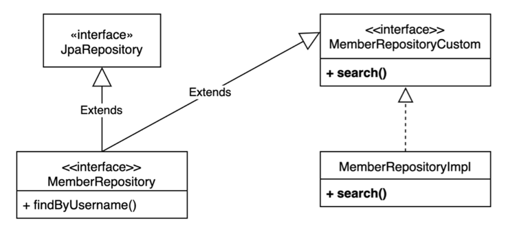

# Querydsl 사용자 정의 리포지토리

## 사용법
1. 사용자 정의 인터페이스 작성
2. 사용자 정의 인터페이스 구현
3. 스프링 데이터 리포지토리에 사용자 정의 인터페이스 상속

## 사용자 정의 리포지토리 구성


* **MemberRepositoryCustom**
  * 사용자 정의 리포지토리 인터페이스
* **MemberRepositoryImpl**
  * 사용자 정의 리포지토리 구현체
  * `MemberRepository` + `Impl` 으로 클래스 명을 선언해야한다.
* **JpaRepository**
  * `spring data jpa` 에서 제공
* **MemberRepository**
  * `JpaRepository`와 `MemberRepositoryCustom`(사용자 정의 리포지토리)를 상속받은 인터페이스

### MemberRepositoryCustom
```java
public interface MemberRepositoryCustom {
  List<MemberTeamDto> search(MemberSearchCondition condition);
}
```

### MemberRepositoryImpl
반드시 `MemberRepository` + `Impl` 으로 클래스 명을 선언
```java
@RequiredArgsConstructor
public class MemberRepositoryImpl implements MemberRepositoryCustom {

    private final JPAQueryFactory queryFactory;

    @Override
    public List<MemberTeamDto> search(MemberSearchCondition condition) {
        return queryFactory
                .select(new QMemberTeamDto(
                        member.id.as("memberId"),
                        member.username,
                        member.age,
                        team.id.as("teamId"),
                        team.name.as("teamName")
                ))
                .from(member)
                .leftJoin(member.team, team)
                .where(
                        usernameEq(condition.getUsername()),
                        teamNameEq(condition.getTeamName()),
                        ageGoe(condition.getAgeGoe()),
                        ageLoe(condition.getAgeLoe())
                )
                .fetch();
    }

    private BooleanExpression usernameEq(String username) {
        return StringUtils.hasText(username) ? member.username.eq(username) : null;
    }

    private BooleanExpression teamNameEq(String teamName) {
        return StringUtils.hasText(teamName) ? team.name.eq(teamName) : null;
    }

    private BooleanExpression ageGoe(Integer ageGoe) {
        return ageGoe != null ? member.age.goe(ageGoe) : null;
    }

    private BooleanExpression ageLoe(Integer ageLoe) {
        return ageLoe != null ? member.age.loe(ageLoe) : null;
    }
}
```

### MemberRepository
```java
public interface MemberRepository extends JpaRepository<Member, Long>, 
        MemberRepositoryCustom {
    List<Member> findByUsername(String username);
}
```